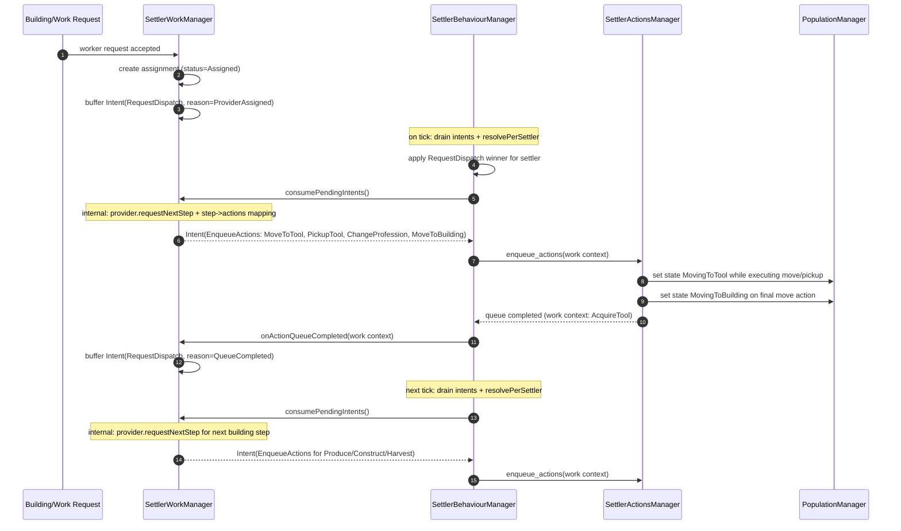

# Settler Behaviour Orchestration Refactor (Technical Design)

Date: 2026-02-21
Status: Proposed
Scope: `SettlerBehaviourManager`, `SettlerWorkManager`, `SettlerNeedsManager`, new `SettlerNavigationManager`

## 1. Problem Statement

`packages/game/src/Settlers/Behaviour/index.ts` currently mixes:

1. orchestration control flow,
2. needs/work domain branching,
3. movement conflict/recovery logic,
4. direct state mutation and queue side effects.

This makes the file long, raises coupling pressure between managers, and obscures ownership of priority/conflict rules.

## 2. Design Goals

1. Keep `SettlerBehaviourManager` as the only orchestrator/executor.
2. Keep dependencies one-way: `Behaviour -> Work`, `Behaviour -> Needs`, `Behaviour -> Navigation`.
3. Standardize manager outputs as shared `BehaviourIntent` objects.
4. Keep priority/conflict policy in behaviour only.
5. Keep shared types manager-agnostic (no cross-manager metadata inside intents).

## 3. Dependency Graph (Target)

1. `SettlerBehaviourManager`
   - depends on `SettlerWorkManager`, `SettlerNeedsManager`, `SettlerNavigationManager`.
2. `SettlerWorkManager`
   - depends on provider/runtime components.
3. `SettlerNeedsManager`
   - depends on needs planner/runtime components.
4. `SettlerNavigationManager`
   - depends on movement/population/map + minimal work read model.

Constraint: `Work`, `Needs`, and `Navigation` do not import or call `Behaviour`.

## 4. Shared Contract: `BehaviourIntent`

File: `packages/game/src/Settlers/Behaviour/intentTypes.ts`

```ts
export enum BehaviourIntentType {
  EnqueueActions = 'ENQUEUE_ACTIONS',
  PauseAssignment = 'PAUSE_ASSIGNMENT',
  ResumeAssignment = 'RESUME_ASSIGNMENT',
  SetWaitState = 'SET_WAIT_STATE',
  RequestDispatch = 'REQUEST_DISPATCH',
}

export enum BehaviourIntentPriority {
  Critical = 400,
  High = 300,
  Normal = 200,
  Low = 100,
}

export enum EnqueueActionsReason {
  NeedPlan = 'NEED_PLAN',
  WorkStep = 'WORK_STEP',
  NavigationYield = 'NAVIGATION_YIELD',
}

export enum PauseAssignmentReason {
  NeedInterrupt = 'NEED_INTERRUPT',
  NavigationYield = 'NAVIGATION_YIELD',
  DomainRule = 'DOMAIN_RULE',
}

export enum ResumeAssignmentReason {
  NeedInterruptEnded = 'NEED_INTERRUPT_ENDED',
  RecoveryCompleted = 'RECOVERY_COMPLETED',
}

export enum SetWaitStateReason {
  WaitingForDispatch = 'WAITING_FOR_DISPATCH',
  RecoveringMovement = 'RECOVERING_MOVEMENT',
  ClearWait = 'CLEAR_WAIT',
}

export enum RequestDispatchReason {
  QueueCompleted = 'QUEUE_COMPLETED',
  ProviderAssigned = 'PROVIDER_ASSIGNED',
  Recovery = 'RECOVERY',
}

export type BehaviourIntent =
  | {
      type: BehaviourIntentType.EnqueueActions
      priority: BehaviourIntentPriority
      settlerId: string
      actions: SettlerAction[]
      context: ActionQueueContext
      reason: EnqueueActionsReason
    }
  | {
      type: BehaviourIntentType.PauseAssignment
      priority: BehaviourIntentPriority
      settlerId: string
      reason: PauseAssignmentReason
    }
  | {
      type: BehaviourIntentType.ResumeAssignment
      priority: BehaviourIntentPriority
      settlerId: string
      reason: ResumeAssignmentReason
    }
  | {
      type: BehaviourIntentType.SetWaitState
      priority: BehaviourIntentPriority
      settlerId: string
      reason: SetWaitStateReason
      waitReason?: WorkWaitReason
    }
  | {
      type: BehaviourIntentType.RequestDispatch
      priority: BehaviourIntentPriority
      settlerId: string
      reason: RequestDispatchReason
      atMs?: number
    }
```

Rules:

1. No `source` field in shared intent type.
2. Priority is explicit and numeric via `BehaviourIntentPriority`.
3. No `requestedAtMs` in shared intent type.

## 5. Intent Semantics and Usage Examples

1. `ENQUEUE_ACTIONS`
   - meaning: request queue insertion for explicit action sequence.
   - example: needs manager builds an eat plan and asks behaviour to enqueue consume-food actions.

2. `PAUSE_ASSIGNMENT`
   - meaning: temporary pause of current work assignment.
   - example: urgent hunger interrupt pauses woodcutting assignment.

3. `RESUME_ASSIGNMENT`
   - meaning: resume previously paused assignment when interrupt/recovery is done.
   - example: after sleep plan finishes, settler resumes paused construction assignment.

4. `SET_WAIT_STATE`
   - meaning: request non-queue wait-mode transition in settler runtime.
   - example: movement recovery marks settler as recovering and updates wait reason.
   - note: intent carries semantic `reason`, not direct `state`; behaviour maps `reason -> SettlerState`.

5. `REQUEST_DISPATCH`
   - meaning: ask work pipeline to (re)run assignment dispatch flow.
   - example: provider assignment changed or queue completed; settler should seek next work action.

## 6. Why `SET_WAIT_STATE` Exists

`SET_WAIT_STATE` covers runtime transitions that are not action-queue operations and not assignment lifecycle operations.

Examples:

1. clear a stale moving/waiting runtime state before redispatch,
2. set a recover/wait mode while pathing or assignment preconditions are revalidated,
3. unify wait-state mutations under behaviour execution (same orchestration path as other intents).

It should carry only semantic reason + optional wait metadata. Concrete `SettlerState` choice remains behaviour policy.

## 7. Priority Model and Examples

Priority is first-class so not every need preempts work.

Recommended mapping:

1. critical need interrupt (`critical hunger/fatigue`) -> `Critical` (400),
2. urgent need interrupt or navigation conflict requiring immediate reaction -> `High` (300),
3. standard work dispatch and regular work-step action enqueue -> `Normal` (200),
4. soft retries/background redispatch/recovery housekeeping -> `Low` (100).

Example:

1. Settler has normal hunger maintenance intent at `Low`.
2. Same tick work emits `RequestDispatch` at `Normal`.
3. Work dispatch wins, so settler continues work.
4. If hunger becomes critical, needs emits `PauseAssignment` + `EnqueueActions` at `Critical`, which then preempts.

## 8. Behaviour-Local Metadata (Not Shared)

Behaviour already knows which manager it is calling. It attaches origin/order locally:

```ts
export enum IntentOrigin {
  Needs = 'needs',
  Navigation = 'navigation',
  Work = 'work',
}

export interface TaggedIntent {
  origin: IntentOrigin
  intent: BehaviourIntent
  arrivalOrder: number
}
```

`arrivalOrder` is a behaviour-local monotonic counter used only for deterministic tie-breaks.

## 9. Priority Policy (Behaviour Only)

File: `packages/game/src/Settlers/Behaviour/intentPolicy.ts`

```ts
export function rankIntent(intent: BehaviourIntent): number {
  return intent.priority
}

export function rankOrigin(origin: IntentOrigin): number {
  // tiebreak only when priorities are equal
  if (origin === IntentOrigin.Needs) return 3
  if (origin === IntentOrigin.Navigation) return 2
  return 1
}
```

Priority is carried by intents; behaviour owns tie-break policy and conflict reduction.

## 10. Manager API Pattern (Consistent)

All domain managers use the same outward contract:

```ts
update(nowMs: number): void
consumePendingIntents(): BehaviourIntent[]
onX(...): void
```

Examples:

1. Needs: `onNeedPlanEnqueueFailed(...)`
2. Work: `onDispatchRequested(...)`, `onProviderAssigned(...)`
3. Navigation: `onYieldRequested(...)`

## 11. Orchestration Control Flow

```ts
onTick(nowMs) {
  needs.update(nowMs)
  work.update(nowMs)
  navigation.update(nowMs)

  const tagged = [
    ...tagAs(Needs, needs.consumePendingIntents()),
    ...tagAs(Navigation, navigation.consumePendingIntents()),
    ...tagAs(Work, work.consumePendingIntents()),
  ]

  const executionPlan = resolvePerSettler(tagged)
  execute(executionPlan)
}
```

Event handlers feed manager buffers (`onX(...)`), then tick drains and executes.

## 12. What `resolvePerSettler` Does

`resolvePerSettler(taggedIntents)` builds a deterministic execution plan:

1. Group intents by `settlerId`.
2. Sort each settler group by:
   - intent priority (`Critical > High > Normal > Low`),
   - then origin rank (`needs > navigation > work`) as tiebreak,
   - then `arrivalOrder`.
3. Apply conflict rules per settler:
   - only one `ENQUEUE_ACTIONS` winner per cycle,
   - `PAUSE_ASSIGNMENT`/`RESUME_ASSIGNMENT`: keep final legal state,
   - `SET_WAIT_STATE`: last-writer wins after higher-rank intents are applied,
   - drop `REQUEST_DISPATCH` when queue is non-idle.
4. Return side-effect commands for behaviour executor.

Result: consistent behavior with policy centralized in one place.

## 13. `ss:work:dispatch-requested` in This Model

1. Work manager receives event and records `REQUEST_DISPATCH` intent.
2. Behaviour does not execute directly from event callback.
3. Behaviour executes only through normal tick drain + `resolvePerSettler`.

This keeps orchestration single-path while preserving existing event producers.

## 14. Migration Plan

1. Introduce `intentTypes.ts` with enum-based `type`.
2. Rename `Decision` to `Intent` across behaviour/work/needs contracts.
3. Remove shared payload fields: `source`, `requestedAtMs`.
4. Add shared `BehaviourIntentPriority` and per-manager priority mapping.
5. Add behaviour-local `TaggedIntent` and policy resolver.
6. Add `SettlerNavigationManager`; move yield/recovery logic from behaviour.
7. Update behaviour listeners to call `onX(...)` on managers only.
8. Add tests for `resolvePerSettler` ordering/conflict rules.

## 15. Validation

Unit:

1. manager-specific intent generation,
2. `resolvePerSettler` ordering by priority + origin + arrival,
3. conflict reductions (`ENQUEUE_ACTIONS`, pause/resume, dispatch drop).

Integration:

1. needs interrupt preempts work enqueue,
2. yield handling preserves assignment continuity,
3. `ss:work:dispatch-requested` flows through work-intent-behaviour path.

## 16. Acceptance Criteria

1. No `Needs -> Behaviour` orchestration dependency.
2. Behaviour file focuses on orchestration, policy, execution.
3. Shared intent type is manager-agnostic.
4. Priority/conflict policy exists only in behaviour.
5. Existing gameplay behavior preserved by tests.

## 17. Control-Flow Graph Example (Worker Assigned -> Tool -> Building)



Key points:

1. `WorkProvider` is internal to `SettlerWorkManager` and not visible to behaviour.
2. Behaviour orchestrates intent intake/resolution only; work-domain step logic stays in work manager.
3. Queue completion feeds back into `RequestDispatch`, keeping one orchestration path.
