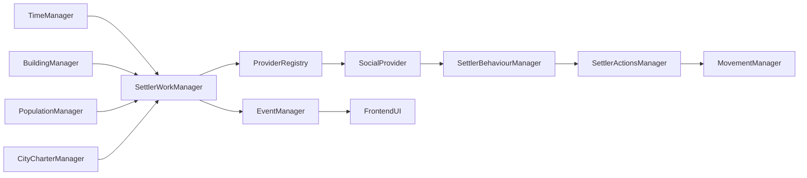
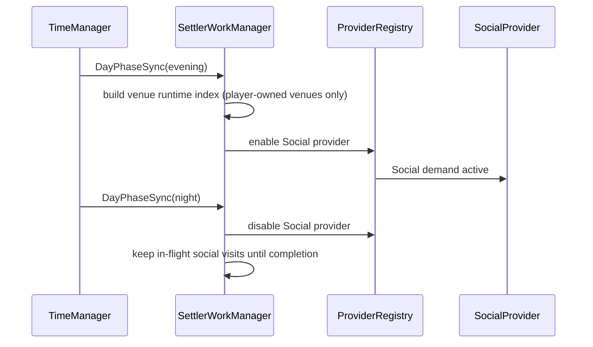
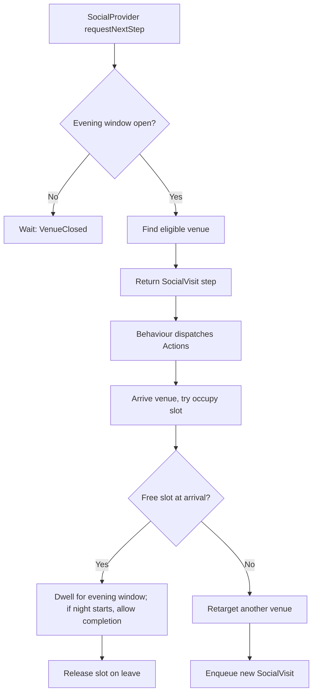

# Document 11 Technical Sketch: Day/Night Social Life With Finite POI Slots

Scope: implementation-level design for `docs/brainstorm/progress/11_day_night_social_life_slots.md`, fully integrated into the existing Settler Work intent pipeline.

## 1. Implementation Goal

Add evening social behavior where:
- any settler can participate
- settlers choose social venues by preference + random + distance
- venues expose finite physical slots
- settlers reserve and occupy slots through existing Work -> Behaviour -> Actions flow
- day phase transitions dynamically switch provider behavior
- no point accumulation system is implemented in this phase

## 2. Architecture Decision (All In Work Module)

No standalone `SettlerSocialManager` for MVP.

Use current intent architecture with one intent owner:
- `SettlerWorkManager` owns social runtime state and provider activation
- `SocialProvider` supplies social steps during evening
- `SettlerBehaviourManager` remains the only dispatcher
- `SettlerNeedsManager` keeps interrupt/preemption priority

New/updated files:
- `packages/game/src/Settlers/Work/providers/SocialProvider.ts`
- `packages/game/src/Settlers/Work/stepHandlers/socialVisit.ts`
- `packages/game/src/Settlers/Work/runtime.ts` (add social runtime state)
- `packages/game/src/Settlers/Work/index.ts` (phase hook + provider gating)
- `packages/game/src/Settlers/Work/types.ts` (new provider/step/wait reasons)

## 3. Day-Phase Dynamic Behavior

Phase policy (MVP):
- `morning`, `midday`: social provider disabled
- `evening`: social provider enabled
- `night`: social provider disabled for new assignments, in-flight social visits can finish

Provider selection policy:
- at `evening` start, settlers finish their current active step first
- once their active step ends, they can receive social intent
- no extra "critical work whitelist" is used in this phase
- use fixed global social travel limit `SOCIAL_MAX_TRAVEL_TILES`

Transition hooks:
1. Time phase changes to `evening`:
- build venue index
- enable social provider in provider registry

2. Time phase changes to `night`:
- disable social provider
- do not issue new social visits
- allow already-started social dwell to complete
- release occupancy when dwell completes

3. Time phase changes to `morning`:
- reset daily social counters/locks

## 4. TypeScript Interface Sketch

```ts
import type { DayPhase } from '../../Time/types'
import type { BuildingInstanceId, SettlerId, PlayerId, MapId } from '../../ids'
import type { Position } from '../../types'

export type SocialVenueType =
  | 'entertainment'
  | 'worship'
  | 'culture_science'
  | 'civic'
  | 'hygiene_social'

export interface SocialVenueDefinition {
  venueType: SocialVenueType
  capacity: number
  slotOffsets: Array<{ x: number; y: number }>
  openPhases: DayPhase[] // usually ['evening']
  charterTierMin?: string
}

export interface SocialProfile {
  entertainment: number
  worship: number
  cultureScience: number
  civic: number
}

export interface SocialReservation {
  buildingInstanceId: BuildingInstanceId
  slotIndex: number
  settlerId: SettlerId
  occupiedAtMs: number
}

export interface SocialVenueRuntimeState {
  buildingInstanceId: BuildingInstanceId
  mapId: MapId
  playerId: PlayerId
  venueType: SocialVenueType
  slotWorldPositions: Position[]
  occupiedSlots: SocialReservation[]
}

export interface WorkSocialRuntimeState {
  currentPhase: DayPhase
  maxTravelTiles: number
  venuesByMap: Map<MapId, SocialVenueRuntimeState[]>
  targetVenueBySettler: Map<SettlerId, BuildingInstanceId>
}
```

Selection score (MVP):
`score = prefWeight + randomJitter - distancePenalty`

Notes:
- capacity is not part of pre-arrival scoring
- capacity is checked only when settler arrives at venue

## 5. Engine Type Extensions

`packages/game/src/Buildings/types.ts`:

```ts
socialVenue?: SocialVenueDefinition
```

`packages/game/src/Settlers/Work/types.ts`:

```ts
enum WorkProviderType {
  // existing...
  Social = 'social'
}

enum WorkStepType {
  // existing...
  SocialVisit = 'social_visit'
}

enum WorkWaitReason {
  // existing...
  VenueClosed = 'venue_closed',
  VenueFull = 'venue_full',
  NoSocialVenue = 'no_social_venue'
}
```

Work step variant:

```ts
| {
    type: WorkStepType.SocialVisit
    buildingInstanceId: BuildingInstanceId
    targetPosition: Position
    dwellTimeMs: number
    retryCount?: number
  }
```

## 6. Event Contract Sketch

Keep minimal sync events only.

```ts
// server-side
Event.Settlers.Work.SS.SocialWindowOpened
Event.Settlers.Work.SS.SocialWindowClosed
Event.Settlers.Work.SS.SocialOccupy
Event.Settlers.Work.SS.SocialRelease
Event.Settlers.Work.SS.SocialRetargeted

// client sync
Event.Settlers.Work.SC.SocialVenueStateSync
```

Payload example:

```ts
type SocialVenueStateSync = {
  venues: Array<{
    buildingInstanceId: string
    occupied: number
    capacity: number
    open: boolean
  }>
}
```

## 7. Dependency Graph



## 8. Control Flow Diagrams

### 8.1 Phase Transition Reconfiguration



### 8.2 Social Visit Intent Flow



## 9. Example Building Definitions (No Points Yet)

```ts
export const plazaSocial = {
  id: 'plaza',
  name: 'Plaza',
  category: 'civil',
  constructionTime: 20,
  footprint: { width: 3, height: 3 },
  costs: [
    { itemType: 'stone', quantity: 4 },
    { itemType: 'planks', quantity: 2 }
  ],
  socialVenue: {
    venueType: 'civic',
    capacity: 9,
    slotOffsets: [
      { x: 0, y: 0 }, { x: 1, y: 0 }, { x: 2, y: 0 },
      { x: 0, y: 1 }, { x: 1, y: 1 }, { x: 2, y: 1 },
      { x: 0, y: 2 }, { x: 1, y: 2 }, { x: 2, y: 2 }
    ],
    openPhases: ['evening'],
    charterTierMin: 'settlement'
  }
}
```

```ts
export const tavernSocial = {
  id: 'tavern',
  name: 'Tavern',
  category: 'civil',
  constructionTime: 24,
  footprint: { width: 3, height: 3 },
  costs: [
    { itemType: 'planks', quantity: 5 },
    { itemType: 'stone', quantity: 2 }
  ],
  socialVenue: {
    venueType: 'entertainment',
    capacity: 6,
    slotOffsets: [
      { x: 0, y: 0 }, { x: 1, y: 0 }, { x: 2, y: 0 },
      { x: 0, y: 1 }, { x: 1, y: 1 }, { x: 2, y: 1 }
    ],
    openPhases: ['evening'],
    charterTierMin: 'market-town'
  }
}
```

## 10. Persistence and Reset Rules

- occupancy is transient runtime state in Work module
- no pre-arrival reservation persists
- on save/load, stale occupancy is revalidated and dropped if invalid

Charter gating semantics:
- locked venues remain visible in world/buildings
- locked venues are excluded from SocialProvider candidate set
- locked venues are excluded from social-specific UI lists

## 11. MVP Implementation Sequence

1. Extend `BuildingDefinition` with `socialVenue`.
2. Add social runtime state in Work module.
3. Add `WorkProviderType.Social` + `SocialProvider`.
4. Add `WorkStepType.SocialVisit` + step handler.
5. Add phase-transition hooks in Work manager for provider enable/disable and day dynamics:
- evening: enable provider, let current work steps finish first
- night: disable new social assignment, allow in-flight social visits to finish
- morning: reset daily locks
6. Emit minimal venue occupancy sync for UI.
7. Add two venue definitions (`plaza`, `tavern`) and validate behavior.

## 12. Testing Checklist

- any settler is eligible for social provider (subject to baseline filters like alive/map/player)
- no capacity check occurs before arrival; capacity check occurs at venue on arrival
- full venue at arrival triggers retarget attempt
- slot capacity never exceeded with concurrent arrivals
- occupancy released on path failure, need interrupt, building removal
- social provider disabled outside evening
- evening->night transition allows in-flight social visits to finish
- Work provider gating is deterministic across phase changes
- charter-locked venues are not offered by provider
- only same-player venues are eligible for occupancy
