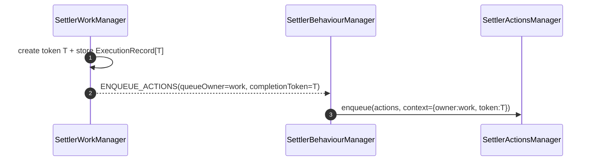
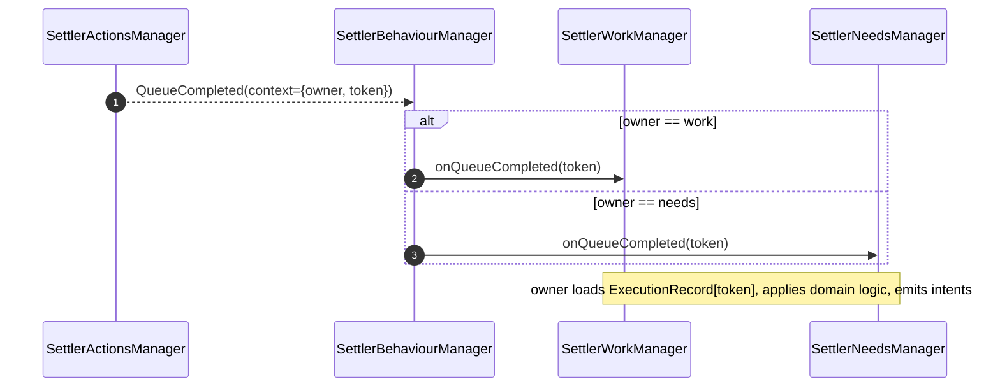
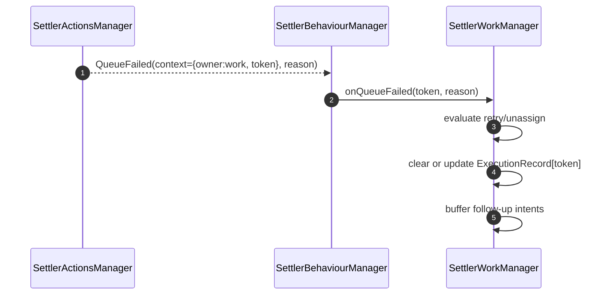

# Intent Completion Token Design

Date: 2026-02-21
Status: Proposed
Scope: replace queue completion context payload coupling with tokenized owner routing.

## 1. Problem

Current flow stores domain-specific queue context (`ActionQueueContextKind.Work/Need` with fields like `step`, `needType`) inside action queue entries.

Issues:

1. Behaviour receives completion and branches using domain context payload.
2. Queue context shape is coupled to domain internals.
3. Completion handling relies on persisted rich payload instead of stable execution identity.
4. Boundary is unclear: behaviour appears generic, but completion logic depends on domain-specific context details.

## 2. Design Goals

1. Keep behaviour as a pure router/executor, not domain payload interpreter.
2. Route queue completion/failure by owner + token only.
3. Keep domain completion semantics in owner manager (`Work`, `Needs`, `Navigation`).
4. Keep snapshot payload compact and version-stable.

## 3. Core Model

## 3.1 Queue execution owner

```ts
export enum QueueOwner {
  Work = 'work',
  Needs = 'needs',
  Navigation = 'navigation'
}
```

## 3.2 Execution token

```ts
export type QueueExecutionToken = string
```

Token properties:

1. generated by owner manager at intent creation time,
2. opaque to behaviour and action manager,
3. stable identifier for completion routing.

## 3.3 Queue execution context

Replace domain-rich queue context with minimal routing context:

```ts
export interface QueueExecutionContext {
  owner: QueueOwner
  token: QueueExecutionToken
}
```

## 3.4 Owner-side pending execution map

Each owner manager keeps:

```ts
Map<QueueExecutionToken, ExecutionRecord>
```

`ExecutionRecord` is owner-private and can contain domain payload (e.g. work step, need type, retry metadata).

## 4. Intent Contract Change

`ENQUEUE_ACTIONS` intent carries routing metadata:

```ts
{
  type: BehaviourIntentType.EnqueueActions,
  priority: BehaviourIntentPriority,
  settlerId: string,
  actions: SettlerAction[],
  queueOwner: QueueOwner,
  completionToken: QueueExecutionToken,
  reason: EnqueueActionsReason
}
```

Behaviour passes `{ owner, token }` to action queue context when enqueueing.

## 5. Control Flow

## 5.1 Enqueue path



## 5.2 Completion path



## 5.3 Failure path



## 6. Dependency Diagram

```mermaid
graph TD
  Behaviour[SettlerBehaviourManager] -->|enqueue intent execution| Actions[SettlerActionsManager]
  Actions -->|QueueCompleted/QueueFailed + {owner,token}| Behaviour

  Behaviour -->|onQueueCompleted(token)/onQueueFailed(token)| Work[SettlerWorkManager]
  Behaviour -->|onQueueCompleted(token)/onQueueFailed(token)| Needs[SettlerNeedsManager]
  Behaviour -->|onQueueCompleted(token)/onQueueFailed(token)| Navigation[SettlerNavigationManager]

  Work --> WorkMap[(Work ExecutionRecord Map)]
  Needs --> NeedsMap[(Needs ExecutionRecord Map)]
  Navigation --> NavMap[(Navigation ExecutionRecord Map)]
```

Behaviour does not inspect domain payload.

## 7. Snapshot Strategy

Persist action queue context as `{ owner, token }` only.

Owner manager snapshot stores execution maps, for example:

1. `work.executionRecords` under work snapshot,
2. `needs.executionRecords` under needs snapshot.

Recovery rule on load:

1. if queue token exists but owner map entry missing, owner treats completion as stale and no-ops with warning.

## 8. API Changes

## 8.1 Behaviour

1. `executeEnqueueIntent` maps intent fields -> queue context `{ owner, token }`.
2. Queue handlers route by `owner` only.

## 8.2 Work/Needs/Navigation

Add token-based handlers:

```ts
onQueueCompleted(token: QueueExecutionToken): void
onQueueFailed(token: QueueExecutionToken, reason: SettlerActionFailureReason): void
```

and token lifecycle methods:

```ts
registerExecution(record): QueueExecutionToken
consumePendingIntents(): BehaviourIntent[]
```

## 9. Migration Plan

### Phase A: Introduce token context model

1. Add `QueueOwner`, `QueueExecutionToken`, `QueueExecutionContext`.
2. Extend `ENQUEUE_ACTIONS` intent with `queueOwner` and `completionToken`.

### Phase B: Owner maps

1. Implement execution record maps in Work and Needs.
2. Start generating tokens for new enqueued actions.

### Phase C: Behaviour routing switch

1. Update behaviour queue complete/fail handlers to route by owner+token.
2. Remove queue context branches based on domain payload (`step`, `needType`).

### Phase D: Remove old context payload

1. Remove `ActionQueueContextKind.Work/Need` from queue completion routing path.
2. Keep only minimal owner/token context in action queue state.

### Phase E: Snapshot alignment

1. Add owner execution maps to snapshots.
2. Provide one-version backward migration if old queue context payload exists.

## 10. Validation

Unit tests:

1. token generation/lookup/cleanup in Work and Needs,
2. behaviour routes completion to correct owner using owner+token,
3. stale token handling is safe and deterministic.

Integration tests:

1. work step enqueue -> complete -> redispatch via token route,
2. needs plan enqueue -> complete/fail -> interrupt lifecycle via token route,
3. save/load mid-queue preserves completion routing correctness.

## 11. Acceptance Criteria

1. Behaviour no longer interprets work/needs-specific queue payload.
2. Queue context uses only `{ owner, token }`.
3. Domain completion logic is fully owner-managed.
4. Typecheck and unit/integration tests pass.

## 12. Risks and Mitigations

1. Risk: token leak in owner maps.
   - Mitigation: mandatory cleanup on complete/fail/unassign/reset.
2. Risk: orphaned queue contexts after deserialize.
   - Mitigation: stale-token no-op handling + warning metric.
3. Risk: migration complexity across snapshots.
   - Mitigation: one-version compatibility loader and dedicated migration tests.
