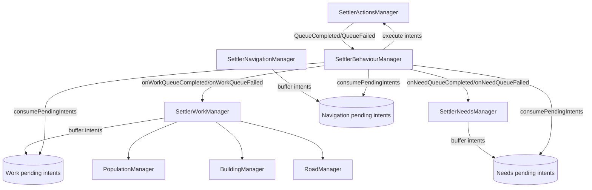
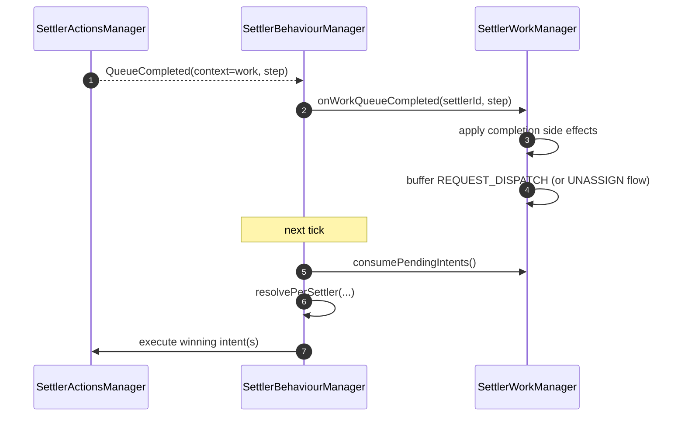
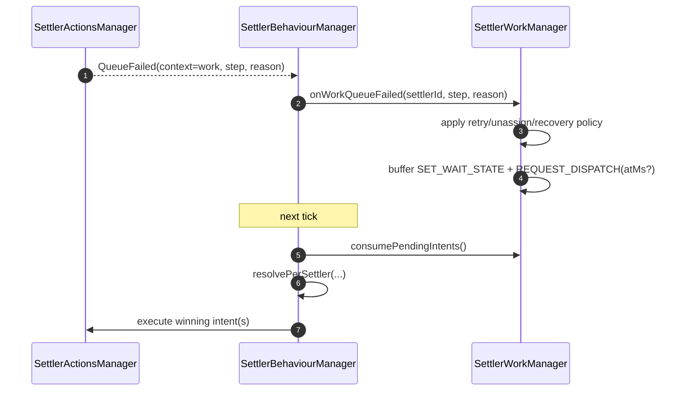

# Work Step Lifecycle Extraction Design

Date: 2026-02-21
Status: Proposed
Scope: move work queue step lifecycle handling from `SettlerBehaviourManager` to `SettlerWorkManager`.

## 1. Background

After the intent refactor, behaviour is mostly orchestration. One major domain block is still in behaviour:

- `WorkStepLifecycleHandler` (`packages/game/src/Settlers/Behaviour/rules/WorkStepLifecycleHandler.ts`)
- queue callbacks wired from behaviour (`packages/game/src/Settlers/Behaviour/index.ts`)

This keeps work-domain completion/failure rules under behaviour, which breaks desired one-way encapsulation.

## 2. Problem Statement

`WorkStepLifecycleHandler` currently owns work-domain logic such as:

1. step completed/failed event emission,
2. production and construction side effects,
3. logistics unassign behavior,
4. movement-failure retry and cooldown scheduling.

These rules belong to work domain and should not be hosted by behaviour.

## 3. Goals

1. Behaviour remains orchestration-only: collect intents, resolve intents, execute side effects.
2. Work owns all work-step lifecycle semantics.
3. Queue completion/failure for work goes through work API, not behaviour-side domain handler.
4. Existing gameplay behavior remains unchanged.

## 4. Non-Goals

1. Rewriting needs planning flow.
2. Rewriting navigation yield/recovery logic.
3. Changing gameplay tuning values (retry delay, failure thresholds).

## 5. Current vs Target Ownership

| Concern | Current Owner | Target Owner |
|---|---|---|
| Work queue complete/fail domain rules | Behaviour (`WorkStepLifecycleHandler`) | Work (`WorkStepLifecycle`) |
| Movement failure counts/recovery for work steps | Behaviour state | Work state |
| Pending redispatch scheduling for work step retry | Behaviour state | Work state/intents |
| Intent conflict resolution | Behaviour | Behaviour |

## 6. Target Dependency Diagram



Key direction rule: work/needs/navigation do not call behaviour.

## 7. Target Control Flow

### 7.1 Work queue completed



### 7.2 Work queue failed



## 8. API Changes

## 8.1 Work runtime API additions

File: `packages/game/src/Settlers/Work/runtime.ts`

```ts
onWorkQueueCompleted(settlerId: SettlerId, step?: WorkStep): void
onWorkQueueFailed(settlerId: SettlerId, step: WorkStep | undefined, reason: SettlerActionFailureReason): void
consumePendingIntents(): BehaviourIntent[]
```

## 8.2 Behaviour queue routing changes

File: `packages/game/src/Settlers/Behaviour/index.ts`

- Work queue context branch becomes routing only:

```ts
if (context.kind === ActionQueueContextKind.Work) {
  work.onWorkQueueCompleted(...) // or onWorkQueueFailed(...)
  return
}
```

No step lifecycle domain logic remains in behaviour.

## 8.3 Work internal component

New file:
- `packages/game/src/Settlers/Work/WorkStepLifecycle.ts`

Responsibilities:

1. handle step completed semantics,
2. handle step failed semantics,
3. update work-owned recovery bookkeeping,
4. push follow-up intents.

## 9. State Migration

Current behaviour snapshot fields:

- `movementRecoveryUntil`
- `movementRecoveryReason`
- `movementFailureCounts`
- `pendingDispatchAtMs`

Plan:

1. move work-specific recovery fields into `WorkProviderSnapshot`.
2. keep behaviour snapshot focused on behaviour-orchestration state only.
3. provide snapshot migration fallback for one release cycle:
   - if old behaviour fields exist, hydrate work state from them when work state is empty.

## 10. Intent Mapping Rules (Work Lifecycle)

Completion path examples:

1. normal completion -> `REQUEST_DISPATCH(priority=Normal, reason=QueueCompleted)`
2. logistics no pending requests + non-warehouse -> unassign (no dispatch intent)

Failure path examples:

1. movement failed/cancelled under retry limit:
   - `SET_WAIT_STATE(reason=RecoveringMovement, waitReason=MovementFailed|MovementCancelled)`
   - `REQUEST_DISPATCH(atMs=now+cooldown, reason=Recovery)`
2. movement failed over max retries:
   - unassign + clear recovery counters

## 11. Migration Phases

### Phase A: introduce work lifecycle API and component

1. Add `onWorkQueueCompleted/onWorkQueueFailed` to work manager.
2. Move logic from `WorkStepLifecycleHandler` into work component.
3. Keep behaviour behaviorally equivalent by calling new work API.

### Phase B: remove behaviour lifecycle handler

1. Delete `WorkStepLifecycleHandler` usage from behaviour.
2. Remove `stepLifecycle` field.
3. Keep only queue routing in behaviour.

### Phase C: move state ownership

1. Move retry/recovery/pending-dispatch state to work snapshot.
2. Add one-time snapshot compatibility read.
3. Remove obsolete behaviour snapshot fields.

### Phase D: cleanup

1. Remove dead types/imports under behaviour rules.
2. Remove any behaviour rule that depends on moved work state.

## 12. Validation Plan

Unit tests:

1. work lifecycle completion -> expected intents/side effects.
2. work lifecycle failure movement retry -> expected wait + delayed dispatch intent.
3. work lifecycle failure max retries -> expected unassign.

Integration tests:

1. assigned worker completes step and redispatches correctly.
2. movement failure retries then unassigns at threshold.
3. needs interrupt still preempts work after extraction.

Smoke checks:

1. `npm run check-types --workspace=@rugged/game`
2. `npm run test --workspace=@rugged/game -- --run tests/unit`

## 13. Acceptance Criteria

1. `SettlerBehaviourManager` has no `WorkStepLifecycleHandler` field.
2. Work step completion/failure domain logic exists only in work domain.
3. Behaviour queue handlers only route by context kind.
4. No behaviour dependency from work/needs/navigation.
5. Typecheck and unit tests pass.

## 14. Risks and Mitigations

1. Risk: subtle order changes in failure recovery.
   - Mitigation: add deterministic lifecycle tests before and after extraction.
2. Risk: snapshot compatibility regressions.
   - Mitigation: explicit migration branch and fixture tests for deserialize/serialize.
3. Risk: duplicated side effects during transition.
   - Mitigation: temporary assertions guarding double emission in work lifecycle paths.
